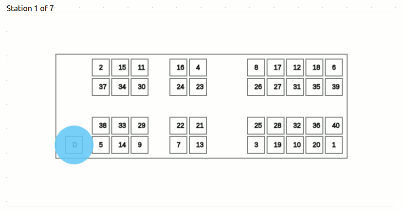
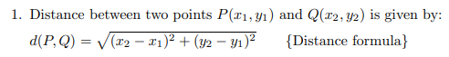
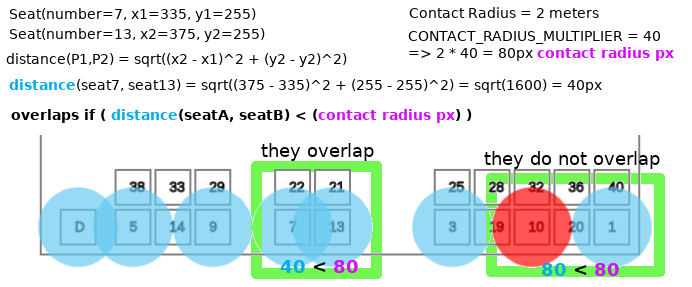
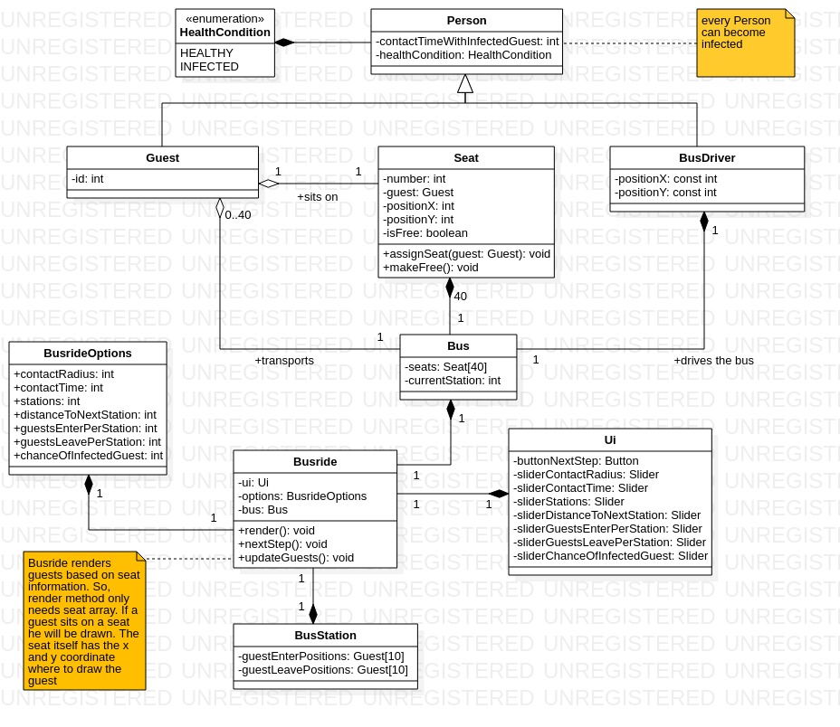

# COVID-19 ÖPNV Busride Simulator
The COVID-19 ÖPNV Busride Simulator simulates busrides with healthy
guests and guests who are infected with COVID-19. Feel free to
play around with various parameters affecting the infection spread.
The generated metrics can be downloaded when the simulation
finishes. A download button will appear between the render area and
the start button.

based on [midudev's simulator](https://github.com/midudev/covid-19-spread-simulator).

# Contents
1. [Dependencies](https://github.com/gre90r/COVID-19-Busride-Simulator#1-dependencies)
2. [Start Application](https://github.com/gre90r/COVID-19-Busride-Simulator#2-start-application)
3. [Run Tests](https://github.com/gre90r/COVID-19-Busride-Simulator#3-run-tests)
4. [Run UI Tests](https://github.com/gre90r/COVID-19-Busride-Simulator#4-run-ui-tests)
5. [See Test Coverage](https://github.com/gre90r/COVID-19-Busride-Simulator#5-see-test-coverage)
6. [Browser Support](https://github.com/gre90r/COVID-19-Busride-Simulator#6-browser-support)
7. [Assumptions](https://github.com/gre90r/COVID-19-Busride-Simulator#7-assumptions)
    * 7.1 [How entering guests select a seat](https://github.com/gre90r/COVID-19-Busride-Simulator#71-how-entering-guests-select-a-seat)
    * 7.2 [Deviations](https://github.com/gre90r/COVID-19-Busride-Simulator#72-deviations)
    * 7.3 [How the infection spreads](https://github.com/gre90r/COVID-19-Busride-Simulator#73-how-the-infection-spreads)
8. [Parameters](https://github.com/gre90r/COVID-19-Busride-Simulator#8-parameters)
9. [Metrics](https://github.com/gre90r/COVID-19-Busride-Simulator#9-metrics)
10. [Rendering](https://github.com/gre90r/COVID-19-Busride-Simulator#10-rendering)
11. [Changing implementations](https://github.com/gre90r/COVID-19-Busride-Simulator#11-Changing-implementations)
    * 11.1 [Changing min and max values of sliders](https://github.com/gre90r/COVID-19-Busride-Simulator#111-changing-min-and-max-values-of-sliders)
    * 11.2 [Replacing deviation algorithm](https://github.com/gre90r/COVID-19-Busride-Simulator#112-replacing-deviation-algorithm)
    * 11.3 [Changing how guests select a seat](https://github.com/gre90r/COVID-19-Busride-Simulator#113-Changing-how-guests-select-a-seat)
12. [Re-run the application](https://github.com/gre90r/COVID-19-Busride-Simulator#12-re-run-the-application)
13. [Architecture](https://github.com/gre90r/COVID-19-Busride-Simulator#13-architecture)

## 1 Dependencies
In order to run the application you need
* nodejs
    * install nodejs, so you can access `npm` from terminal.
      Therefore, the application is cross platform.
    * all other needed dependencies will be install with
      `npm install`.

## 2 Start Application

1. Install project dependencies:

    `npm install`

2. start development server:

    `npm run dev`

3. open your browser and enter http://localhost:1234

## 3 Run Tests

`npm test`

## 4 Run UI Tests

start the application first: `npm run dev`

now run the tests with `npm run ui-tests` in a
separate terminal

In order to run the tests you need a chromedriver.

**install chromedriver**

Ui tests run on the chrome browser. In order to run the tests
you need to install the compatible chromedriver according to
your chrome version. I used chromedriver
`http://chromedriver.storage.googleapis.com/index.html?path=83.0.4103.39/`
for chrome browser version 83.0.4103.61 and copied it to `/usr/local/bin`

windows users must find a solution for themselves. As hint: I
expect the chromedriver to be accessable from the PATH variable.

## 5 See Test Coverage

`npm run coverage`

## 6 Browser Support

This project is using EcmaScript Modules, therefore, only browsers with this compatibility will work. (Sorry Internet Explorer 11 and old Edge users). - midudev

## 7 Assumptions
### 7.1 How entering guests select a seat
Entering guests select their seat in a given order to keep the most
distance to other guests. For that purpose all bus seats are numbered.
Guests will choose the seat with the lowest number which is free.



### 7.2 Deviations
to make the simulation more realistic we chose to implement deviations for
guests entering, guests leaving and travel time around an average value.
All deviations work with gaussian distribution. 

### 7.3 How the infection spreads
if a healthy guest sits in the contact radius of an infected guest, the healthy guest will infect himself
over time. Therefore the healthy guest has a counter “contact time”. If this value exceeds the slider
value “contact time” in the UI, the healthy guest will be colored red and therefore become infected.
He will now also spread the virus.

Healthy guest surrounded by infected guests:

If a healthy guest sits in the contact radius of many infected guests, then the contact time of the
healthy guest increases for every of these infected guests. E.g. The contact radius of a healthy
guest overlaps with two contact radiuses of infected guests, the healthy guest will infect himself
twice as fast.

how overlaps are detected:





## 8 Parameters
Explaining words which will appear often:

In the following the word "**mean**" is used a few times. It is related
to the standard deviation. Mean describes the average value, which
is the maximum in the gaussian distribution curve. **Standard
Deviation** is how much the gaussian distribution curve is stretched
equally to the left and right, meaning that it is more likely to
get values which are more distant from the mean. Standard Deviation
equal to zero, will only produce the exact value which is defined
by mean.

1. Mean number of guests entering per station
    * how much guests will enter every time the bus arrives
      at the next station. The "mean" is the average value
      which is expected through the whole route.
      
2. Standard Deviation for number of guests entering per station
    * the deviation for how much guests will enter at each station.
      This parameter affects guests entering per station. You can
      observe guests entering per station will be differ. This is
      caused by the gaussian distribution this has been implemented
      with.
      
3. Mean number of guests leaving per station
    * this works exactly the same like guests entering per station.
      See (1. Mean number of guests entering per station).

4. Standard Deviation for number of guests leaving per station
    * this works exactly the same as the deviation for
      guests entering per station. See (2. Standard Deviation
      for number of guests entering per station).

5. Chance of infected guest
    * defines with which percentage a newly generated guest will be
      infected. E.g. you set number guests entering, parameter (1),
      to 10 and chance of infected guest to 10%. Each of these
      guests will have a 10% chance to be infected resulting
      in a ~100% chance to have on infected guest entering the bus,
      with a deviation of the random algorithm of course. 

6. Stations
    * how many stations the bus will have on his route.

7. Mean travel time to next station
    * the average time it takes for the bus to reach the next
      station.
      
8. Standard deviation for travel time to next station
    * the deviation for parameter (7) "Mean travel time to next
      station". The greater the deviation the more likely it is
      to have travel times which are more distant from the mean.
      
9. contact radius
    * the size of the blue and red circles. a healthy guest (blue
      circle) can only be infected when his circle is
      overlapping with the circle of an infected guest (red circle).
      
10. contact time
    * how long it takes for a healthy guest to become infected.
      Let's say contact time is 20 minutes. That means, the circle
      of a healthy guest has to overlap for 20 minutes with a
      circle of an infected guest. Each guest has a counter which
      counts how long he was exposed to an infected guest. Contact
      Time defines how long you can be exposed to an infected
      guest without being infected. 
      
11. automatic simulation progression
    * automatic
        * the simulation runs automatically. You can sit back
          and watch the simulation.
    * step through
        * you click through everything what is happening in the
          simulation. The application waits for you to click next.
    * simulation speed
        * how fast the simulation progresses. 1x means the simulation
          waits 1 second after every action before doing the next
          action. 10x means you divide this 1x simulation speed
          by 10. So you generally wait 1/x seconds. So, 10x waits
          1s/10 = 100ms before continuing with the next action.
      
## 9 Metrics
Metrics which are displayed and can be downloaded as a csv file.

1. Guests
    * number of guests how are currently sitting inside the bus
    
2. Current healthy
    * number of currently healthy guests inside the bus
    
3. Current infected
    * number of currently infected guests inside the bus
    
4. New infections
    * how many healthy guests have been infected by infected guests
      while sitting in the bus.
    
5. Incoming healthy
    * total entering healthy guests
    
6. Incoming infected
    * total entering infected guests
    
7. Outgoing healthy
    * total leaving healthy guests
    
8. Outgoing infected
    * total leaving infected guests

## 10 Rendering
What is when rendered? That depends on the busride state which you
can observe while the application runs. Above the top left corner
of the rendering area, there is the info about the busride state.

Busride States:

1. GUESTS_WAIT_AT_STATION
    * renderGuests
        * renders guests in the bus. This function is always called.
    * renderWaitingGuests

2. GUESTS_ENTER
    * renderGuests
    * renderWaitingGuests
        * difference to GUESTS_WAIT_AT_STATION is that each person from the
          station is teleported one after the other into the bus, therefore
          the remaining waiting guests at the station, and the guests in the
          bus need to be rendered. In addition, we have the teleportation
          "animation" here.

3. DRIVE_TO_NEXT_STATION
    * renderGuests
    
4. GUESTS_LEAVE
    * renderGuests
    * renderLeavingGuests
    
Logic behind rendering:

Via the next button we step through the busride states (GUESTS_WAIT_AT_STATION,
GUESTS_ENTER, DRIVE_TO_NEXT_STATION, GUESTS_LEAVE). We only render what is
defined for the specific busride state as shown above.

## 11 Changing implementations
The following explains where which parameter or implementation
can be changed.

### 11.1 Changing min and max values of sliders
* can be done in index.html

* some parameters can be increased safely such as
  parameter (6) stations or the deviation rates. Parameters
  which are bound to constant values such as e.g. total seats
  in the bus are discouraged to change, since you cannot
  handle non existing seats. You have to first implement
  new seats.

* increasing parameter (1) number of guests entering
    * I discourage you to increase this value by just increasing
      the slider value in the html.
    * the limit of 10 guests entering the bus depends on the number
      of array entries in *guestEnterPositions* at the bus station,
      which is defined in src/model/BusStation.js. if you want more,
      you have to define more `Position`s which have a fixed place
      in the render area.
    
* increasing parameter (6) stations
    * this parameter is safe to increase
    * change in index.html, see
    `<input id="stationsSlider" type="range" min="2" max="50" value="7" class="slider">`

### 11.2 Replacing deviation algorithm
* all deviations are currently implemented with gaussian
  distribution. You can e.g. replace this with exponential
  distribution. There are deviations for guests entering,
  guests leaving and travel time. All these are implemented
  in src/controller/BusrideHelper.js
* changing e.g. the deviation of travel time
    * implementation can be found in src/controller/BusrideHelper.js,
      line 349 (as of today). function name 
      `setTravelTimeDeviation`.
    * change `let randomGaussianTravelTime = Utils.randomNumberFromGaussianDistribution(...)`.
      replace `Utils.randomNumberFromGaussianDistribution(...)` with
      your implementation. It has to return an actual travel time.

### 11.3 Changing how guests select a seat
Go to src/controller/BusrideHelper.js, line 94 (as of today),
function: nextGuestEntersTheBus

```
export function nextGuestEntersTheBus (busStation, bus) {
  const seat = bus.nextFreeSeat()
  ...
```

redefine what `bus.nextFreeSeat()` returns.

Currently, the seats are organized in an array which is sorted
by seat numbers. So you can search for the next free seat with
the lowest seat number as follows:

```
this.seats.forEach(seat => {
  if (seat.isFree) {
    // only assign the first free seat
    if (nextFreeSeat == null) {
      nextFreeSeat = seat
    }
  }
})
```

**Implementing entering guests to keep the safety distance:**

Before assigning a seat, you have to check if the entering
guest would overlap with other guests on that specific seat.
Therefore, you can check the overlapping with the following
function.

src/controller/BusrideHelper.js, line 248
```
export function isRadiusOverlapping (seatA, seatB) {
```

## 12 Re-run the application
please reload the site :)

## 13 Architecture

